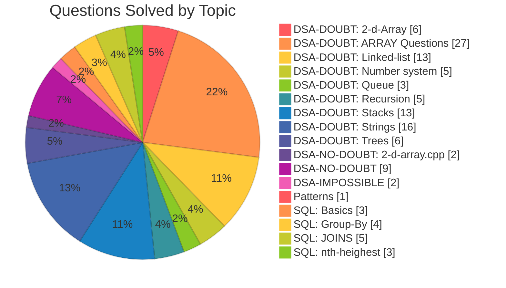

# LeetCode Solutions - Piyush Singh

This repository contains my **personally written solutions** to problems from
[LeetCode - My Profile](https://leetcode.com/u/potp0W9PDy/) and
[Coding Ninjas - My Profile](https://www.naukri.com/code360/profile/5069fcf7-6ca2-4579-8268-ce3ed3bdc990).

## Guidelines

- All code in this repository is **written entirely by me** without the use of AI tools.
- In cases where I hit a roadblock and use AI assistance for understanding or debugging, those solutions will be clearly separated in a different folder (`DSA-Doubt`) and will not be mixed with the rest.

## Structure

- `DSA-DOUBT` - Solutions where I used AI assistance after hitting a roadblock, kept separate from the rest.
- `DSA-NO-DOUBT` - Solutions written without any assistance.
- `DSA-IMPOSSIBLE` - Harder problems I found especially challenging.
- `Patterns` - Pattern-printing problems.
- `SQL` - SQL problems (joins, group by, nth-highest queries, etc.) from LeetCode.

<!-- STATS:START -->
## Progress Stats

**Total Questions Solved: 123**

### DSA-DOUBT (94)

| Topic | Count |
|---|---|
| 2-d-Array | 6 |
| ARRAY Questions | 27 |
| Linked-list | 13 |
| Number system | 5 |
| Queue | 3 |
| Recursion | 5 |
| Stacks  | 13 |
| Strings | 16 |
| Trees | 6 |

### DSA-NO-DOUBT (11)

| Topic | Count |
|---|---|
| 2-d-array.cpp | 2 |
| (General) | 9 |

### DSA-IMPOSSIBLE (2)

| Topic | Count |
|---|---|
| (General) | 2 |

### Patterns (1)

| Topic | Count |
|---|---|
| (General) | 1 |

### SQL (15)

| Topic | Count |
|---|---|
| Basics | 3 |
| Group-By | 4 |
| JOINS | 5 |
| nth-heighest | 3 |
<!-- STATS:END -->

## Purpose

- Practice and improve my problem-solving skills.
- Build a personal reference of solutions.
- Track my progress over time.

## Note

Please do not copy these solutions directly if you're preparing for interviews or competitive exams - write and understand the logic yourself for maximum benefit.

---

**Piyush Singh**
GitHub: [PixxySynchronous](https://github.com/PixxySynchronous)
Email: [theamazingpiyush@gmail.com](mailto:theamazingpiyush@gmail.com)
